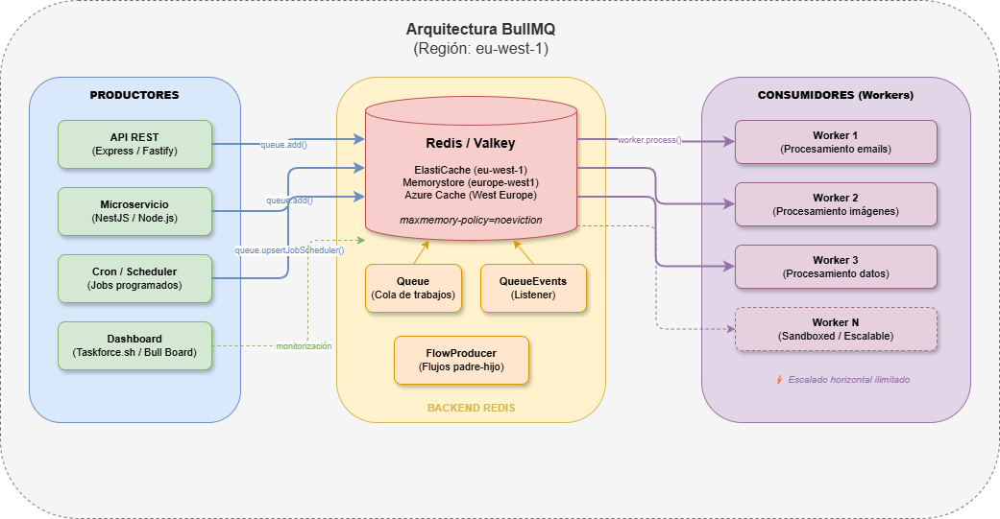

# Informe Técnico: Viabilidad y Costes del Servicio BullMQ

**Fecha:** 20 de mayo de 2026  
**Elaborado por:** Equipo de Infraestructura  
**Versión:** 2.0  
**Clasificación:** Interno  
**Región de referencia:** EU West (Ireland) — `eu-west-1`  

---

## Índice

1. [Resumen Ejecutivo](#1-resumen-ejecutivo)
2. [¿Qué es BullMQ?](#2-qué-es-bullmq)
3. [Arquitectura y Requisitos Técnicos](#3-arquitectura-y-requisitos-técnicos)
4. [Escenarios de Despliegue](#4-escenarios-de-despliegue)
5. [Costes en AWS (Amazon ElastiCache)](#5-costes-en-aws-amazon-elasticache)
6. [Costes de BullMQ Pro (Licencia de Software)](#6-costes-de-bullmq-pro-licencia-de-software)
7. [Costes de Monitorización: Taskforce.sh Dashboard](#7-costes-de-monitorización-taskforcesh-dashboard)
8. [Resumen de Costes y TCO](#8-resumen-de-costes-y-tco)
9. [Análisis de Viabilidad y Recomendación](#9-análisis-de-viabilidad-y-recomendación)
10. [Fuentes y Enlaces Oficiales](#10-fuentes-y-enlaces-oficiales)

---

## 1. Resumen

BullMQ es una librería open source (licencia MIT) de colas de mensajes y procesamiento de trabajos en segundo plano, construida sobre **Redis**. Es utilizada por organizaciones como Microsoft, Vendure, Datawrapper, NestJS, Langfuse y muchas más.

**Conclusión principal:** BullMQ es **técnicamente viable** y **ampliamente adoptado** en producción. El coste principal recae en la infraestructura Redis gestionada (AWS ElastiCache en `eu-west-1`), no en la librería en sí (que es gratuita). El rango de coste mensual estimado va desde **~$0/mes** (desarrollo/pruebas con Free Tier) hasta **varios miles de dólares** dependiendo de la escala y requisitos de alta disponibilidad.

---

## 2. ¿Qué es BullMQ?

BullMQ es la cola de mensajes distribuida más rápida y fiable basada en Redis para Node.js, Python, Elixir y PHP. Cuenta con más de **8.900 estrellas en GitHub**, **+4.1M descargas semanales** en npm y **+10M descargas mensuales**.

### Características principales

| Característica | Descripción |
|---|---|
| **Jobs con prioridad** | Asignación de prioridades a trabajos |
| **Jobs retrasados** | Programación de trabajos para ejecutar en el futuro |
| **Jobs recurrentes (Cron)** | Expresiones cron y intervalos fijos |
| **Reintentos automáticos** | Backoff exponencial configurable |
| **Concurrencia** | Configuración por worker |
| **Rate Limiting** | Limitación de tasa por cola o grupo |
| **Flujos padre-hijo** | Dependencias jerárquicas con profundidad ilimitada |
| **Sandboxed workers** | Procesamiento en hilos aislados |
| **Persistencia** | Los trabajos sobreviven a reinicios del servidor |
| **Multi-lenguaje** | Node.js, Bun, Python, Elixir, PHP |
| **Deduplicación** | Debounce y throttle de trabajos |
| **Eventos globales** | Notificaciones en tiempo real del estado de los jobs |

### Rendimiento

- Capacidad de encolar más de **250.000 jobs por segundo** (benchmark con DragonflyDB)
- Diseño sin polling para **uso mínimo de CPU**
- Escalado horizontal ilimitado añadiendo más workers

---

## 3. Arquitectura y Requisitos Técnicos

### Diagrama de componentes

> 📎 **Diagrama interactivo:** Abrir [`diagrams/bullmq-architecture.drawio`](diagrams/bullmq-architecture.drawio) con [draw.io](https://app.diagrams.net/) o la extensión de VS Code "Draw.io Integration".

### Requisitos mínimos

| Componente | Requisito |
|---|---|
| **Redis** | Redis ≥ 5.0 (recomendado ≥ 6.2), Valkey o DragonflyDB |
| **Configuración Redis** | `maxmemory-policy=noeviction` (OBLIGATORIO) |
| **Node.js** | ≥ 16 (para librería TypeScript/JavaScript) |
| **Python** | ≥ 3.9 (para librería Python) |
| **Conexiones Redis** | Mínimo 1 por Queue + 1 por Worker + 1 por QueueEvents |
| **Librería cliente** | ioredis (se configura automáticamente) |

### Compatibilidad con AWS ElastiCache

BullMQ es compatible con los dos motores disponibles en ElastiCache:
- **Redis OSS** — Motor Redis clásico
- **Valkey** — Fork open source de Redis, **~20% más barato** en ElastiCache

---

## 4. Escenarios de Despliegue

### Escenario 1: Desarrollo / Pruebas (Mínimo)
- 1 instancia Redis pequeña (< 1 GB)
- Sin alta disponibilidad
- 1 worker

### Escenario 2: Producción Básica (Pequeño)
- 1 instancia Redis de 1-6 GB con réplica
- Alta disponibilidad básica
- 2-5 workers

### Escenario 3: Producción Media
- Cluster Redis de 6-26 GB
- Alta disponibilidad multi-AZ
- 5-20 workers
- Monitorización

### Escenario 4: Producción Enterprise (Grande)
- Cluster Redis de 26-100+ GB
- Alta disponibilidad multi-AZ con réplicas
- 20+ workers
- Monitorización avanzada
- BullMQ Pro (opcional)

---

## 5. Costes en AWS (Amazon ElastiCache)

> **Fuente oficial:** [https://aws.amazon.com/elasticache/pricing/](https://aws.amazon.com/elasticache/pricing/)  
> **Calculadora:** [https://calculator.aws/#/createCalculator/ElastiCache](https://calculator.aws/#/createCalculator/ElastiCache)  
> **API de precios:** [https://pricing.us-east-1.amazonaws.com/offers/v1.0/aws/AmazonElastiCache/current/eu-west-1/index.json](https://pricing.us-east-1.amazonaws.com/offers/v1.0/aws/AmazonElastiCache/current/eu-west-1/index.json)  
> **Región de referencia:** EU West (Ireland) — `eu-west-1`

### 5.1 Free Tier

- **750 horas/mes** de instancia `cache.t3.micro` durante 12 meses (cuentas creadas antes del 15/07/2025)
- Cuentas nuevas (post 15/07/2025): **$100 en créditos** + $100 adicionales por activar servicios
- **15 GB** de transferencia de datos de salida gratuitos/mes

### 5.2 Opción Serverless (ElastiCache Serverless)

Escalado automático sin gestión de nodos. Ideal para cargas variables.

| Concepto | Valkey (eu-west-1) | Redis OSS (eu-west-1) |
|---|---|---|
| **Almacenamiento** | $0.094/GB-hora | $0.140/GB-hora |
| **Procesamiento (ECPUs)** | $0.0025/millón ECPUs | $0.0038/millón ECPUs |
| **Mínimo almacenamiento** | 100 MB | 1 GB |

**Ejemplo estimado (10 GB, 50K req/s, Valkey eu-west-1):**
- Almacenamiento: 10 GB × $0.094 = **$0.94/hora**
- ECPUs: 180M ECPUs × $0.0025/M = **$0.45/hora**
- **Total: ~$1.39/hora ≈ $1,015/mes**

### 5.3 Opción On-Demand (Nodos gestionados)

Configuración manual con control total del dimensionamiento.

| Tipo de nodo | vCPU | Memoria | Redis OSS (eu-west-1) | Valkey (eu-west-1) | Precio/mes Redis OSS |
|---|---|---|---|---|---|
| cache.t3.micro | 2 | 0.5 GB | $0.018/hr | $0.0144/hr | ~$13 |
| cache.t3.small | 2 | 1.37 GB | $0.036/hr | $0.0288/hr | ~$26 |
| cache.t3.medium | 2 | 3.09 GB | $0.072/hr | $0.0576/hr | ~$53 |
| cache.m5.large | 2 | 6.38 GB | $0.172/hr | $0.1376/hr | ~$126 |
| cache.m7g.large | 2 | 6.38 GB | $0.174/hr | $0.1392/hr | ~$127 |
| cache.r7g.large | 2 | 13.07 GB | $0.243/hr | $0.1944/hr | ~$177 |
| cache.r7g.xlarge | 4 | 26.32 GB | $0.487/hr | $0.3896/hr | ~$356 |
| cache.r7g.2xlarge | 8 | 52.82 GB | $0.974/hr | $0.7792/hr | ~$711 |

> **Nota:** Valkey ofrece un **20% de descuento** respecto a Redis OSS en nodos on-demand.

### 5.4 Instancias Reservadas (Descuentos)

| Modalidad | Descuento vs On-Demand |
|---|---|
| Sin pago anticipado (1 año) | Hasta **48.2%** |
| Pago parcial anticipado (1 año) | Hasta **52%** |
| Pago total anticipado (1 año) | Hasta **55%** |

### 5.5 Costes adicionales AWS

| Concepto | Coste |
|---|---|
| Transferencia datos (misma AZ) | **Gratis** |
| Transferencia datos (entre AZs) | **$0.01/GB** |
| Backups | **$0.085/GB/mes** |
| Extended Support (Redis EOL) | **+80% (Año 1-2), +160% (Año 3)** |

### 5.6 Estimaciones por escenario (AWS, región eu-west-1)

| Escenario | Configuración | Coste mensual Redis OSS | Con Valkey (~20% menos) |
|---|---|---|---|
| **Dev/Test** | 1× cache.t3.micro (Free Tier) | **$0** (12 meses) | $0 |
| **Dev/Test** | 1× cache.t3.small | **~$26/mes** | ~$21/mes |
| **Prod Básica** | 1× cache.m5.large + réplica (2 nodos) | **~$251/mes** | ~$201/mes |
| **Prod Media** | 3 shards × 2 nodos cache.r7g.large | **~$1,064/mes** | ~$851/mes |
| **Prod Enterprise** | 6 shards × 2 nodos cache.r7g.xlarge | **~$4,266/mes** | ~$3,413/mes |
| **Serverless (10GB, 50K rps)** | ElastiCache Serverless Valkey | — | **~$1,015/mes** |

---

## 6. Costes de BullMQ Pro (Licencia de Software)

> **Fuente oficial:** [https://bullmq.io/](https://bullmq.io/)  
> **Documentación Pro:** [https://docs.bullmq.io/bullmq-pro/introduction](https://docs.bullmq.io/bullmq-pro/introduction)

BullMQ OSS (open source) es **completamente gratuito** bajo licencia MIT. BullMQ Pro es un drop-in replacement con funcionalidades avanzadas.

### 6.1 Funcionalidades exclusivas de BullMQ Pro

| Funcionalidad | Descripción |
|---|---|
| **Groups** | Agrupación de jobs con concurrencia y rate limiting por grupo |
| **Batches** | Consumo de jobs en lotes para mayor eficiencia |
| **Observables** | Jobs como observables RxJS para mejor gestión de estado |
| **Soporte profesional** | Acceso directo a los mantenedores |

### 6.2 Precios BullMQ Pro

| Plan | Precio | Condiciones |
|---|---|---|
| **Standard** | **$1,395/año** ($139/mes) | 1 despliegue*, organizaciones < 100 empleados |
| **Enterprise** | **Custom** | Múltiples despliegues, descuentos por volumen, soporte prioritario |
| **Embedded** | **Custom** | Derechos de redistribución, integración en producto |

*Un despliegue = un entorno operativo distinto (cluster K8s, servidor, VM, etc.)

### 6.3 ¿Es necesario BullMQ Pro?

**NO es obligatorio.** La versión open source cubre la mayoría de casos de uso en producción. Pro es recomendable cuando:
- Se necesita rate limiting por grupo
- Se requiere procesamiento por lotes (batches)
- Se necesita soporte profesional directo

---

## 7. Costes de Monitorización: Taskforce.sh Dashboard

> **Fuente oficial:** [https://taskforce.sh/](https://taskforce.sh/)  
> **Documentación:** [https://docs.taskforce.sh/](https://docs.taskforce.sh/)

Dashboard profesional creado por los mismos autores de BullMQ.

### 7.1 Planes

| Plan | Precio/mes | Conexiones | Características |
|---|---|---|---|
| **Starter** | **$19.95** | 1 | Monitorización, alertas, métricas, gestión de jobs |
| **Growing** | **$49.95** | 5 | + Organizaciones, equipos, roles personalizados |
| **Enterprise** | **$99.95** | 15 | + Soporte prioritario |
| **Self-Hosted** | Contactar | Ilimitadas | Docker on-premises, sin límites de equipo |

- Trial gratuito de **15 días** sin tarjeta de crédito
- Certificaciones: **SOC 2 Type II**, **GDPR**
- Conexión segura mediante TLS (Redis nunca se expone públicamente)

### 7.2 ¿Es necesario el dashboard?

**Recomendado para producción** pero no obligatorio. Alternativas gratuitas incluyen:
- **Bull Board** (open source): UI web básica
- **Arena** (open source): Panel de gestión
- **Métricas custom** con Prometheus + Grafana

---

## 8. Resumen de Costes y TCO

### 8.1 Costes ElastiCache eu-west-1 por escenario (~6 GB, producción con HA)

| Servicio | Configuración | Coste mensual | SLA |
|---|---|---|---|
| ElastiCache Valkey On-Demand | cache.m5.large × 2 (HA) | **~$201/mes** | 99.99% |
| ElastiCache Redis OSS On-Demand | cache.m5.large × 2 (HA) | **~$251/mes** | 99.99% |
| ElastiCache Serverless Valkey | ~6 GB, tráfico bajo | **~$55-120/mes** | 99.99% |

### 8.2 Costes ElastiCache eu-west-1 por escenario (~26 GB, producción)

| Servicio | Configuración | Coste mensual |
|---|---|---|
| ElastiCache Valkey On-Demand | cache.r7g.xlarge × 2 | **~$569/mes** |
| ElastiCache Redis OSS On-Demand | cache.r7g.xlarge × 2 | **~$711/mes** |
| ElastiCache Valkey Reservado (1 año, ~50% dto.) | cache.r7g.xlarge × 2 | **~$285/mes** |

### 8.3 Coste total de propiedad (TCO) estimado — Producción básica

| Componente | Rango de coste mensual |
|---|---|
| ElastiCache eu-west-1 (6 GB, HA, Valkey) | **$201** |
| BullMQ OSS (librería) | **$0** |
| BullMQ Pro (opcional) | $0 – $116 ($1,395/año) |
| Taskforce.sh (monitorización, opcional) | $0 – $99.95 |
| Infraestructura compute (workers) | Variable (ya existente) |
| **TOTAL estimado** | **$201 – $417/mes** |

---

## 9. Análisis de Viabilidad y Recomendación

### 9.1 Viabilidad técnica

| Criterio | Evaluación |
|---|---|
| Madurez del proyecto | ✅ **Alta** — +8.9K stars, +10M descargas/mes, +199 contributors, 849 releases |
| Adopción empresarial | ✅ **Alta** — Microsoft, Vendure, Datawrapper, NestJS, y cientos más |
| Licencia | ✅ **MIT** — Sin restricciones comerciales |
| Soporte multi-lenguaje | ✅ Node.js, Python, Elixir, PHP |
| Compatibilidad AWS | ✅ Compatible con ElastiCache Redis OSS y Valkey |
| Complejidad operativa | ✅ **Baja** — ElastiCache gestionado + librería npm |
| Seguridad | ✅ SOC 2 Type II (Taskforce.sh), conexiones TLS, VPC |
| Escalabilidad | ✅ Horizontal ilimitada |

### 9.2 Recomendación de configuración AWS (eu-west-1)

- ElastiCache con motor **Valkey** (20% más barato que Redis OSS)
- Opción **Serverless** para cargas variables o arranque rápido
- Opción **On-Demand** para cargas predecibles
- Opción **Reservada** (1 año) para ahorrar hasta un 55% en producción estable
- Free Tier disponible para desarrollo (12 meses)

### 9.3 Recomendación por escenario

| Escenario | Configuración recomendada | Coste mensual estimado |
|---|---|---|
| **PoC / Desarrollo** | cache.t3.micro Free Tier | **$0** |
| **Startup / Equipo pequeño** | ElastiCache Serverless Valkey | **$26 – $120/mes** |
| **Producción estándar** | Valkey On-Demand cache.m5.large × 2 + Taskforce Starter | **$220 – $270/mes** |
| **Producción media** | Valkey Reservado cache.r7g.large × 6 + BullMQ Pro + Taskforce Growing | **$450 – $700/mes** |
| **Producción Enterprise** | Valkey Reservado multi-shard cache.r7g.xlarge × 12 + BullMQ Pro + Taskforce Enterprise | **$1,100 – $4,000+/mes** |

### 9.4 Recomendación final

**Se recomienda aprobar la disponibilización del servicio BullMQ** por las siguientes razones:

1. **Coste razonable:** El componente de software (BullMQ) es gratuito. El coste principal es ElastiCache en eu-west-1, que se puede iniciar desde **~$0/mes** (Free Tier) o **~$26/mes** (cache.t3.small) y escalar según necesidad.

2. **Bajo riesgo técnico:** Librería madura, ampliamente adoptada y con soporte activo.

3. **Alineación con mejores prácticas:** BullMQ es el estándar de facto para colas de trabajo en ecosistemas Node.js/TypeScript.

4. **Escalabilidad probada:** Utilizado por empresas que procesan miles de millones de jobs diarios.

5. **Valkey = ahorro:** El motor Valkey en ElastiCache ofrece un **20% de descuento** sobre Redis OSS con compatibilidad total.

**Pasos siguientes propuestos:**
1. Provisionar instancia ElastiCache de desarrollo en eu-west-1 (Free Tier o cache.t3.small)
2. Implementar PoC con el equipo de desarrollo
3. Definir requisitos de capacidad basados en la PoC
4. Provisionar infraestructura de producción según escenario seleccionado
5. Configurar monitorización (Taskforce.sh o alternativa)

---

## 10. Fuentes y Enlaces Oficiales

### BullMQ
| Recurso | URL |
|---|---|
| Sitio web oficial | [https://bullmq.io/](https://bullmq.io/) |
| Documentación oficial | [https://docs.bullmq.io/](https://docs.bullmq.io/) |
| Repositorio GitHub | [https://github.com/taskforcesh/bullmq](https://github.com/taskforcesh/bullmq) |
| API Reference | [https://api.docs.bullmq.io/](https://api.docs.bullmq.io/) |
| BullMQ Pro | [https://docs.bullmq.io/bullmq-pro/introduction](https://docs.bullmq.io/bullmq-pro/introduction) |
| Guía de conexiones | [https://docs.bullmq.io/guide/connections](https://docs.bullmq.io/guide/connections) |
| npm package | [https://www.npmjs.com/package/bullmq](https://www.npmjs.com/package/bullmq) |
| Changelog | [https://github.com/taskforcesh/bullmq/blob/master/CHANGELOG.md](https://github.com/taskforcesh/bullmq/blob/master/CHANGELOG.md) |
| Licencia MIT | [https://github.com/taskforcesh/bullmq/blob/master/LICENSE](https://github.com/taskforcesh/bullmq/blob/master/LICENSE) |

### Monitorización
| Recurso | URL |
|---|---|
| Taskforce.sh (Dashboard oficial) | [https://taskforce.sh/](https://taskforce.sh/) |
| Taskforce.sh Documentación | [https://docs.taskforce.sh/](https://docs.taskforce.sh/) |
| Taskforce.sh Trust Center | [https://trust.taskforce.sh/](https://trust.taskforce.sh/) |

### AWS ElastiCache
| Recurso | URL |
|---|---|
| ElastiCache Pricing | [https://aws.amazon.com/elasticache/pricing/](https://aws.amazon.com/elasticache/pricing/) |
| ElastiCache Features | [https://aws.amazon.com/elasticache/features/](https://aws.amazon.com/elasticache/features/) |
| ElastiCache Documentation | [https://docs.aws.amazon.com/elasticache/](https://docs.aws.amazon.com/elasticache/) |
| AWS Pricing Calculator | [https://calculator.aws/#/createCalculator/ElastiCache](https://calculator.aws/#/createCalculator/ElastiCache) |
| AWS Free Tier | [https://aws.amazon.com/free/](https://aws.amazon.com/free/) |
| Database Savings Plans | [https://aws.amazon.com/savingsplans/database-pricing/](https://aws.amazon.com/savingsplans/database-pricing/) |
| AWS Pricing API (eu-west-1) | [https://pricing.us-east-1.amazonaws.com/offers/v1.0/aws/AmazonElastiCache/current/eu-west-1/index.json](https://pricing.us-east-1.amazonaws.com/offers/v1.0/aws/AmazonElastiCache/current/eu-west-1/index.json) |

### Alternativas Redis compatibles
| Recurso | URL |
|---|---|
| Valkey (fork open source Redis) | [https://valkey.io/](https://valkey.io/) |
| DragonflyDB (alto rendimiento) | [https://www.dragonflydb.io/](https://www.dragonflydb.io/) |
| Redis oficial | [https://redis.io/](https://redis.io/) |

---

> **Nota:** Los precios indicados en este documento se han extraído de la API de precios oficial de AWS y las fuentes oficiales a fecha de mayo de 2026 para la región `eu-west-1` (Ireland). Los precios pueden variar según tipo de acuerdo comercial y promociones vigentes. Se recomienda utilizar la [calculadora oficial de AWS](https://calculator.aws/#/createCalculator/ElastiCache) para obtener estimaciones precisas según la configuración específica requerida.

> **Disclaimer:** Este informe tiene carácter informativo y orientativo. Las decisiones de inversión deben validarse con la calculadora oficial de AWS y las condiciones contractuales vigentes.
